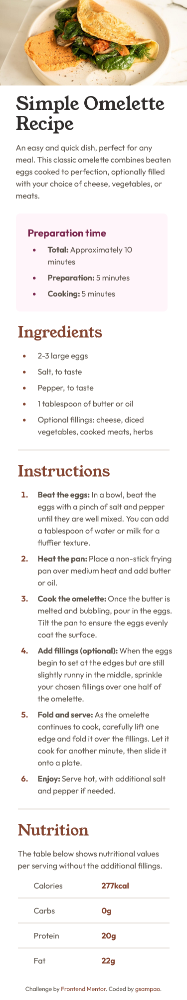
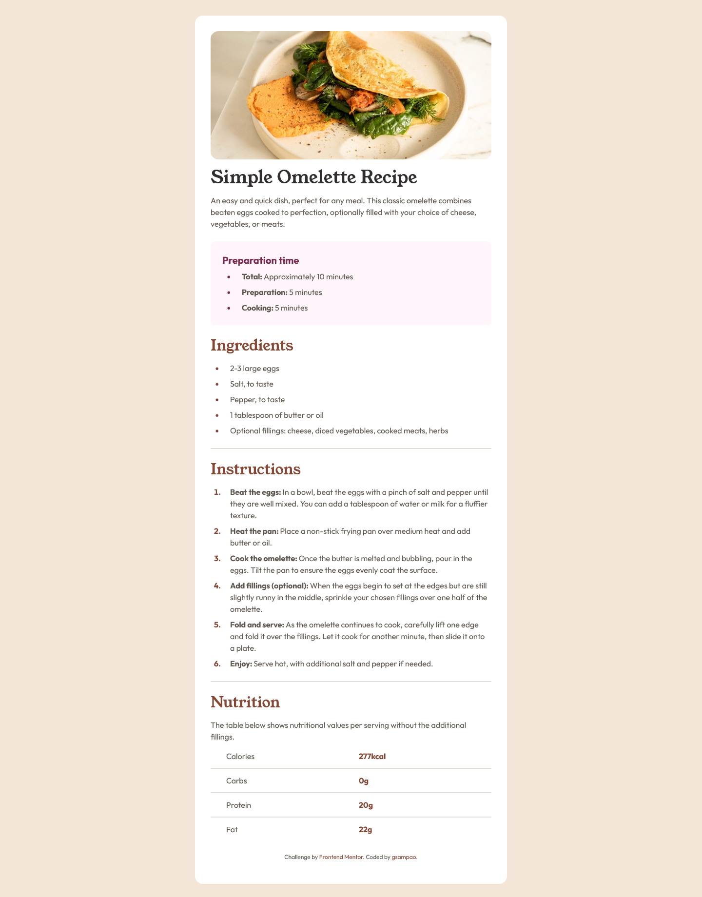

# Frontend Mentor - Recipe page solution

This is a solution to the [Recipe page challenge on Frontend Mentor](https://www.frontendmentor.io/challenges/recipe-page-KiTsR8QQKm). Frontend Mentor challenges help you improve your coding skills by building realistic projects. 

## Table of contents

- [Overview](#overview)
  - [The challenge](#the-challenge)
  - [Screenshot](#screenshot)
  - [Links](#links)
- [My process](#my-process)
  - [Built with](#built-with)
- [Author](#author)

## Overview

### Screenshot

*Mobile - 375px*

 

*Desktop - 1440px*

### Links

- Solution URL: [Frontend Mentor](https://www.frontendmentor.io/solutions/recipe-page-using-react-and-tailwind-_bINr6Y_oC)
- Live Site URL: [Netlify](https://majestic-dusk-788dab.netlify.app/)

## My process

### Built with

- Mobile-first workflow
- [React](https://reactjs.org/) - JS library
- [Tailwind CSS](https://tailwindcss.com/)
- [Vite](https://vitejs.dev/) - Frontend tooling development environment

## Author

- GitHub - [@nadupoy](https://github.com/nadupoy)
- Frontend Mentor - [@nadupoy](https://www.frontendmentor.io/profile/nadupoy)
- LinkedIn - [Grace Sampao](https://www.linkedin.com/in/grace-sampao-49a3129b/)
